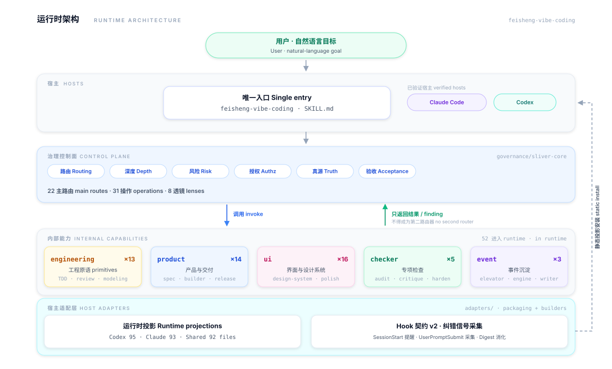
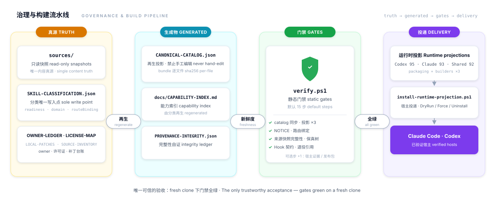

<div align="center">

# Feisheng Vibe Coding

**统一的软件项目 AI 协作运行包**
**A unified AI collaboration runtime package for software projects**

一个公开入口 · 一个主路由 · 每条规则只有一个 owner
One public entry · One main route · Exactly one owner per rule

[](https://github.com/msx2027/feisheng-vibe-coding/actions/workflows/release-gate.yml)


**简体中文** · [English](#english) · [架构图 Architecture](#architecture)

</div>

---

<a id="architecture"></a>

## 🏗️ 架构总览 · Architecture at a Glance

**调用链 Call chain**

```text
用户目标 → 一个主路由 → 条件 lens / 一个或多个内部能力 → 统一验证与验收
User goal → one main route → conditional lens / one or more internal capabilities → unified verification & acceptance
```

**运行时架构 Runtime architecture** — 用户只接触一个入口；控制面是唯一的项目级决策者，内部能力只能返回结果或 finding，不得成为第二个路由器。

<picture>
  <source media="(prefers-color-scheme: dark)" srcset="docs/assets/architecture-runtime-dark.svg">
  
</picture>

**治理与构建流水线 Governance & build pipeline** — 真源（人写）→ 生成物（只可再生）→ 门禁（单入口）→ 投影 → 安装。

<picture>
  <source media="(prefers-color-scheme: dark)" srcset="docs/assets/architecture-pipeline-dark.svg">
  
</picture>

> 图为 [`docs/assets/architecture.mjs`](docs/assets/architecture.mjs) 再生的双主题 SVG（跟随 GitHub 明暗模式自动切换），调整后运行 `node docs/assets/architecture.mjs` 重新生成。Theme-aware SVGs regenerated from the builder — run `node docs/assets/architecture.mjs` after changes.

---

<a id="中文"></a>

## 📖 简体中文

### 这是什么

统一的软件项目 AI 协作运行包：对外**只有一个项目级入口** `feisheng-vibe-coding`，对内把三个源项目的能力按职责合并 —— **Sliver** 管项目级治理控制面（路由、深度、风险、授权、真源、验收），**Matt** 管工程原语（TDD、调试、领域建模、review），**Vibe** 管产品/UI、事件沉淀与宿主适配。用户只说自然语言，入口经控制面选定唯一主路由，按需调用内部能力，并以新鲜证据完成验证。

### 当前状态（2026-09-11 闭环后受控运行）

- 三个源项目已完成快照与全量校验并删除本体；仓库内 `sources/` 快照是**唯一内容真源**，逐文件 sha256 自证。
- **82 条**来源技能全量登记定编：**52 条进入 runtime**（432 文件）、**23 条退役**（快照保留、可重走准入）、**7 条排除/兼容**。
- 纯中文自然语言触发（D2）与全链路路由（D3）已在真实宿主会话实测转绿。
- Hook 适配器契约 v2：**纠错信号采集面已启用**（SessionStart 只读提醒 / UserPromptSubmit 采集 / `-Mode Digest` 消化标记）；治理门禁事件仍禁用归控制面。
- **GitHub Actions CI 全绿**（`ubuntu-latest`：`verify.ps1` 静态门禁 + 发布候选包装配）。

| 指标 | 数值 |
|---|---|
| 来源技能登记 / runtime / 退役 / 排除 | 82 / **52** / 23 / 7 |
| Runtime bundle | 432 文件（catalog 逐文件 sha256 自证；2026-09-18 门禁实测） |
| 主路由 / Operation / Lens | 22 / 31 / 8 |
| 静态门禁 | `verify.ps1` 默认 17 步（`-IncludeHostEvidence` / `-IncludePackage` 各 +1） |
| CI | GitHub Actions · `ubuntu-latest` · 全绿 |

> [!WARNING]
> 以下项保持 `UNVERIFIED`，在拿到新鲜证据前不声称生效：宿主 trust、逐技能行为质量（用一次验一次）、Hook 的宿主 fresh-session 冒烟、沉淀消费技能（三件套）的接入。

### 四个唯一 Owner

| Owner | 真源 | 拥有 |
|---|---|---|
| `route-catalog` | `governance/sliver-core/references/routes-index.md` | 主路由、operation、lens、reference 加载映射（排他） |
| `skill-catalog` | `provenance/SKILL-CLASSIFICATION.json`（唯一写入点） | 技能 id、来源、调用类型、触发边界、runtime 文件清单 |
| `target-truth` | `docs/target-truth-schema.json`（本仓只持 schema 契约） | 目标项目的需求、计划、术语、任务状态、验收与写权限 |
| `runtime-projection` | `packaging/runtime-projection.json` + builders | 面向 Codex、Claude 等宿主的运行包生成规则 |

另有 9 个仲裁/登记类 owner（`validation-gate`、`bug-rescue`、`ui-quality` 等）登记于 [`provenance/OWNER-LEDGER.json`](provenance/OWNER-LEDGER.json)。下游 README、插件清单、镜像和生成 JSON 都只能是投影，不能反向成为 owner。

### 设计原则

1. 一个公开入口，一个主路由。
2. 规则只有一个 owner，其他位置只引用或生成投影。
3. Sliver 管项目级决策和门禁；Matt 管工程原语；Vibe 管产品/UI 和宿主适配。
4. 先证明来源、许可证、revision 和可重建性，再迁移行为。
5. 宿主 Hook 没有 fresh-session 证据时，只报告 `UNVERIFIED`。

### 来源与能力构成

| 来源 | 角色 | 快照位置 | 登记 | 已接入 |
|---|---|---|---|---|
| sliver-vibe-coding | 控制面 | `governance/sliver-core/`（220 文件） | 1 | 1 |
| vibe-coding-skills | 产品 / UI / 事件 / checker | `sources/vibe-coding-skills/`（553 文件） | 46 | 38 |
| mattpocock-skills | 工程原语 | `sources/mattpocock-skills/`（136 文件） | 35 | 13 |

### 修改可用集合（唯一流程）

> [!IMPORTANT]
> 分类决策的唯一写入点是 `provenance/SKILL-CLASSIFICATION.json`。`CANONICAL-CATALOG.json` 与 `docs/CAPABILITY-INDEX.md` 是生成物，**只能再生、不得手工编辑**。

```powershell
# 1. 修改分类：provenance/SKILL-CLASSIFICATION.json（readiness / domain / routeBinding）
# 2. 重生成 catalog
pwsh scripts/build-canonical-catalog.ps1 -RepoRoot <repo>
# 3. 重生成本能力索引
pwsh scripts/build-capability-index.ps1 -RepositoryRoot <repo>
# 4. 跑门禁
pwsh scripts/verify.ps1 -RepositoryRoot <repo>
```

### 目录结构

```text
feisheng-vibe-coding/
├─ governance/            # 项目级控制面（Sliver：路由/深度/风险/授权/验收）
│  └─ sliver-core/        # 控制面协议 SKILL.md + references + assets
├─ skills/                # 一等技能（只接入通过五门禁的能力）
│  ├─ engineering/        # 工程原语（Matt）：tdd · code-review · domain-modeling …
│  ├─ product/            # 产品（Vibe）：dev-builder · product-spec-builder …
│  ├─ ui/                 # UI（Vibe）：design-system · ui-ux-pro-max · impeccable …
│  ├─ checker/            # 专项检查：audit · clarify · critique · harden · optimize
│  └─ event/              # 事件沉淀：experience-elevator · evolution-engine · feedback-writer
├─ sources/               # 三源只读快照（唯一内容真源，永不改写）
├─ provenance/            # 来源/分类/许可证/owner 台账 + 生成投影
├─ adapters/              # 宿主适配（Hook 契约 v2：纠错信号采集）
├─ packaging/             # runtime projection 策略
├─ scripts/               # 导入/生成/门禁/安装 单入口工具链
├─ docs/                  # ARCHITECTURE · CAPABILITY-INDEX（生成物）· HANDOFF-NEXT
├─ evidence/              # 每批次验收证据
└─ tests/                 # 单元/回归用例
```

### 常用命令

```powershell
# 全套静态门禁（提交后必须重跑）
pwsh -NoProfile -File scripts/verify.ps1 -RepositoryRoot <repo>

# 宿主投递（干跑 / 安装 / 卸载）
pwsh -NoProfile -File scripts/install-runtime-projection.ps1 -RepositoryRoot <repo> -DryRun
pwsh -NoProfile -File scripts/install-runtime-projection.ps1 -RepositoryRoot <repo> -Force
pwsh -NoProfile -File scripts/install-runtime-projection.ps1 -RepositoryRoot <repo> -Uninstall

# 唯一可信的验收方式：fresh clone 下门禁全绿
git clone <repo> <新目录> && cd <新目录>
pwsh -NoProfile -File scripts/verify.ps1 -IncludePackage
```

### 文档治理工具（新项目接入）

`scripts/check-doc-governance.mjs` 是面向任意目标项目的文档命名/归位治理检查器（零依赖 Node，可移植）：门面 H1 与文件名同步、docs 空目录残留、类目目录散落 md、全项目正文重名、门面导航双向登记、孤儿卷目录；并从 frontmatter（`status: completed|resolved|deprecated`）自动检测归档候选，归档经人确认后由 `--archive` 一键执行（git mv + 引用改链 + 归档门面登记；有未提交改动时拒绝执行）。

新项目开箱接入（只新增/追加，不覆盖既有内容）：

```sh
node scripts/init-doc-governance.mjs <目标项目根>
```

### 文档导航

| 文档 | 说明 |
|---|---|
| [`docs/ARCHITECTURE.md`](docs/ARCHITECTURE.md) | 统一架构：四个 owner、分层、不可物理合并的边界 |
| [`docs/CAPABILITY-INDEX.md`](docs/CAPABILITY-INDEX.md) | 能力索引（生成物，52 条 runtime 权威快照） |
| [`docs/HANDOFF-NEXT.md`](docs/HANDOFF-NEXT.md) | 交接必读：目标准成手册与当前宿主状态 |
| [`provenance/OWNER-LEDGER.json`](provenance/OWNER-LEDGER.json) | owner、投影和写入权限的机器可读记录 |
| [`provenance/SOURCE-BASELINE.json`](provenance/SOURCE-BASELINE.json) | 三源快照树摘要基线 |
| [`AGENTS.md`](AGENTS.md) | 仓库规则（owner / 迁移 / 验收） |

---

<a id="english"></a>

## 🌍 English

### What is this

A unified AI collaboration runtime package for software projects. Externally there is **exactly one project-level entry**: `feisheng-vibe-coding`. Internally it merges capabilities from three source projects by responsibility — **Sliver** owns the project governance control plane (routing, depth, risk, authorization, truth, acceptance), **Matt** owns engineering primitives (TDD, debugging, domain modeling, review), and **Vibe** owns product/UI, event sedimentation, and host adapters. The user speaks natural language only; the entry selects one main route through the control plane, invokes internal capabilities on demand, and closes with verification backed by fresh evidence.

### Current status (controlled run since 2026-09-11 closure)

- The three source projects were snapshotted, fully verified, and deleted; the in-repo `sources/` snapshots are the **single source of content truth**, self-attested by per-file sha256.
- **82** source skills fully registered and classified: **52 in runtime** (432 files), **23 retired** (snapshots kept; re-admission restarts the full gate), **7 excluded/compat**.
- Pure-Chinese natural-language triggering (D2) and end-to-end routing (D3) verified green in real host sessions.
- Hook adapter contract v2: the **correction-signal collection surface is enabled** (SessionStart read-only reminder / UserPromptSubmit collection / `-Mode Digest` markers); governance gate events remain disabled and belong to the control plane.
- **GitHub Actions CI is green** (`ubuntu-latest`: `verify.ps1` static gates + release-candidate packaging).

| Metric | Value |
|---|---|
| Registered / runtime / retired / excluded | 82 / **52** / 23 / 7 |
| Runtime bundle | 432 files (per-file sha256 attested in the catalog; measured 2026-09-18) |
| Main routes / operations / lenses | 22 / 31 / 8 |
| Static gates | `verify.ps1`, 17 steps by default (`-IncludeHostEvidence` / `-IncludePackage` add 1 each) |
| CI | GitHub Actions · `ubuntu-latest` · green |

> [!WARNING]
> The following remain `UNVERIFIED` and must not be claimed as effective without fresh evidence: host trust, per-skill behavior quality (verified per use), host fresh-session smoke for hooks, and the sedimentation-consumer trio integration.

### The four unique owners

| Owner | Source of truth | Owns |
|---|---|---|
| `route-catalog` | `governance/sliver-core/references/routes-index.md` | Main routes, operations, lenses, reference loading map (exclusive) |
| `skill-catalog` | `provenance/SKILL-CLASSIFICATION.json` (sole write point) | Skill ids, provenance, invocation types, trigger boundaries, runtime file lists |
| `target-truth` | `docs/target-truth-schema.json` (schema contract only in this repo) | Requirements, plans, terminology, task status, acceptance and write authority of target projects |
| `runtime-projection` | `packaging/runtime-projection.json` + builders | Rules for generating host runtime packages (Codex, Claude, …) |

Nine more arbitration/registry owners (`validation-gate`, `bug-rescue`, `ui-quality`, …) are recorded in [`provenance/OWNER-LEDGER.json`](provenance/OWNER-LEDGER.json). Downstream READMEs, plugin manifests, mirrors, and generated JSON are projections only and can never become owners.

### Design principles

1. One public entry, one main route.
2. Every rule has exactly one owner; everything else references it or is a generated projection.
3. Sliver owns project-level decisions and gates; Matt owns engineering primitives; Vibe owns product/UI and host adapters.
4. Prove provenance, license, revision, and reproducibility before migrating behavior.
5. Without fresh-session evidence for host hooks, report `UNVERIFIED` — nothing stronger.

### Sources and capability composition

| Source | Role | Snapshot | Registered | Admitted |
|---|---|---|---|---|
| sliver-vibe-coding | Control plane | `governance/sliver-core/` (220 files) | 1 | 1 |
| vibe-coding-skills | Product / UI / events / checkers | `sources/vibe-coding-skills/` (553 files) | 46 | 38 |
| mattpocock-skills | Engineering primitives | `sources/mattpocock-skills/` (136 files) | 35 | 13 |

### Changing the available set (the only path)

> [!IMPORTANT]
> The sole write point for classification decisions is `provenance/SKILL-CLASSIFICATION.json`. `CANONICAL-CATALOG.json` and `docs/CAPABILITY-INDEX.md` are generated artifacts — **regenerate them; never hand-edit**.

```powershell
# 1. Edit classification: provenance/SKILL-CLASSIFICATION.json (readiness / domain / routeBinding)
# 2. Regenerate the canonical catalog
pwsh scripts/build-canonical-catalog.ps1 -RepoRoot <repo>
# 3. Regenerate the capability index
pwsh scripts/build-capability-index.ps1 -RepositoryRoot <repo>
# 4. Run the gates
pwsh scripts/verify.ps1 -RepositoryRoot <repo>
```

<details>
<summary><strong>Repository layout</strong></summary>

```text
feisheng-vibe-coding/
├─ governance/            # Project control plane (Sliver: routing/depth/risk/authz/acceptance)
│  └─ sliver-core/        # Control-plane protocol SKILL.md + references + assets
├─ skills/                # First-class skills (only gate-passing capabilities are admitted)
│  ├─ engineering/        # Engineering primitives (Matt): tdd · code-review · domain-modeling …
│  ├─ product/            # Product (Vibe): dev-builder · product-spec-builder …
│  ├─ ui/                 # UI (Vibe): design-system · ui-ux-pro-max · impeccable …
│  ├─ checker/            # Targeted checks: audit · clarify · critique · harden · optimize
│  └─ event/              # Event sedimentation: experience-elevator · evolution-engine · feedback-writer
├─ sources/               # Read-only three-source snapshots (single content truth, never rewritten)
├─ provenance/            # Provenance / classification / license / owner ledgers + generated projections
├─ adapters/              # Host adapters (hook contract v2: correction-signal collection)
├─ packaging/             # Runtime projection policy
├─ scripts/               # Single-entry toolchain: import / build / gates / install
├─ docs/                  # ARCHITECTURE · CAPABILITY-INDEX (generated) · HANDOFF-NEXT
├─ evidence/              # Per-batch acceptance evidence
└─ tests/                 # Unit / regression cases
```

</details>

### Common commands

```powershell
# Full static gate suite (re-run after every commit)
pwsh -NoProfile -File scripts/verify.ps1 -RepositoryRoot <repo>

# Host delivery (dry-run / install / uninstall)
pwsh -NoProfile -File scripts/install-runtime-projection.ps1 -RepositoryRoot <repo> -DryRun
pwsh -NoProfile -File scripts/install-runtime-projection.ps1 -RepositoryRoot <repo> -Force
pwsh -NoProfile -File scripts/install-runtime-projection.ps1 -RepositoryRoot <repo> -Uninstall

# The only trustworthy acceptance: gates green on a fresh clone
git clone <repo> <dir> && cd <dir>
pwsh -NoProfile -File scripts/verify.ps1 -IncludePackage
```

### Doc governance tool (onboarding a new project)

`scripts/check-doc-governance.mjs` is a portable, zero-dependency Node checker for doc naming/placement governance in any target project: facade H1 ↔ filename sync, empty docs directories, stray markdown in category folders, duplicate body titles repo-wide, bidirectional facade navigation registration, and orphan volume directories. It also detects archive candidates from frontmatter (`status: completed|resolved|deprecated`); archiving is human-confirmed, then executed in one shot with `--archive` (git mv + reference relinking + archive facade registration; refuses with uncommitted changes).

Bootstrap a new project (adds/appends only, never overwrites existing content):

```sh
node scripts/init-doc-governance.mjs <target-project-root>
```

### Documentation map

| Document | Description |
|---|---|
| [`docs/ARCHITECTURE.md`](docs/ARCHITECTURE.md) | Unified architecture: four owners, layering, non-mergeable boundaries |
| [`docs/CAPABILITY-INDEX.md`](docs/CAPABILITY-INDEX.md) | Capability index (generated; authoritative snapshot of the 52 runtime skills) |
| [`docs/HANDOFF-NEXT.md`](docs/HANDOFF-NEXT.md) | Handoff manual: goal-completion playbook and current host state |
| [`provenance/OWNER-LEDGER.json`](provenance/OWNER-LEDGER.json) | Machine-readable record of owners, projections, and write authority |
| [`provenance/SOURCE-BASELINE.json`](provenance/SOURCE-BASELINE.json) | Tree-digest baseline of the three source snapshots |
| [`AGENTS.md`](AGENTS.md) | Repository rules (owners / migration / acceptance) |

---

<div align="center">

<sub>Capability numbers defer to the generated <a href="docs/CAPABILITY-INDEX.md">capability index</a>; this README is hand-maintained and carries no classification decisions.<br/>
本 README 人工维护；能力数量口径以生成物 <a href="docs/CAPABILITY-INDEX.md">CAPABILITY-INDEX</a> 为准，不承载分类决策。</sub>

</div>
